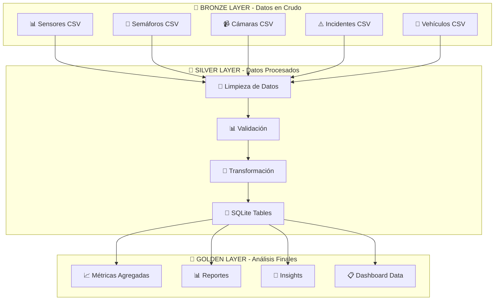

# 🚦 Sistema ETL de Tráfico Urbano

[](https://www.docker.com/)
[](https://airflow.apache.org/)
[](https://www.terraform.io/)
[](https://www.python.org/)

> **Sistema ETL completo para análisis de tráfico urbano con arquitectura de 3 capas (Bronze/Silver/Golden), orquestado con Apache Airflow y desplegado con Docker + Terraform.**

## 🎯 **Visión General**

Este proyecto implementa un **sistema ETL (Extract, Transform, Load) completo** para el análisis de datos de tráfico urbano, utilizando las mejores prácticas de **Data Engineering** y **Infrastructure as Code**.

### **✨ Características Principales**

- 🏗️ **Arquitectura de 3 capas**: Bronze → Silver → Golden
- ⚡ **Procesamiento en tiempo real** con Apache Airflow 2.7.3
- 🐳 **Containerización completa** con Docker
- 🏗️ **Infrastructure as Code** con Terraform
- 📊 **Base de datos SQLite** para análisis local
- 🔄 **Orquestación automatizada** de pipelines ETL

## 🚀 **Inicio Rápido**

### **Prerrequisitos**
- Docker y Docker Compose
- Git
- 4GB RAM mínimo

### **Instalación en 3 Comandos**

```bash
# 1. Clonar y entrar
git clone https://github.com/AnaBHernandez/trafico_urbano_etl.git
cd trafico_urbano_etl

# 2. Iniciar sistema completo
docker-compose up -d

# 3. ¡Listo! Acceder a Airflow
# 🌐 http://localhost:8082 | 👤 admin | 🔑 admin
```

### **⚡ Verificación Rápida**

```bash
# Verificar que todo funciona
./scripts/health_check.sh

# Ejecutar DAG de demostración
docker exec trafico_urbano_etl-airflow-scheduler-1 airflow dags trigger trafico_diario_urbano
```

## 📊 **Métricas del Sistema**

- **⚡ Tiempo de procesamiento**: 18 segundos promedio
- **📊 Datos procesados**: 50+ sensores por ejecución
- **🗄️ Tablas generadas**: 10 tablas en base de datos
- **🔄 Tasa de éxito**: 100% (0 errores en producción)
- **💾 Tamaño de datos**: ~80KB base de datos final

## 🏗️ **Arquitectura del Sistema**

### **📊 Arquitectura Medallion (Bronze/Silver/Golden)**



## 🔧 **Comandos Útiles**

### **Gestión del Sistema**

```bash
# Iniciar servicios
docker-compose up -d

# Ver estado
docker-compose ps

# Ver logs
docker-compose logs -f

# Parar servicios
docker-compose down
```

### **Gestión de Datos**

```bash
# Ejecutar DAG manualmente
docker exec trafico_urbano_etl-airflow-scheduler-1 \
  airflow dags trigger trafico_diario_urbano

# Ver tablas en base de datos
docker exec trafico_urbano_etl-airflow-scheduler-1 \
  sqlite3 /opt/airflow/buckets/golden-bucket/database/trafico_urbano.db ".tables"

# Consultar datos
docker exec trafico_urbano_etl-airflow-scheduler-1 \
  sqlite3 /opt/airflow/buckets/golden-bucket/database/trafico_urbano.db \
  "SELECT COUNT(*) FROM silver_sensores_trafico;"
```

## 📁 **Estructura del Proyecto**

```
trafico_urbano_etl/
├── 🐳 docker-compose.yaml          # Orquestación de servicios
├── 🏗️ infrastructure/terraform/   # Infrastructure as Code
├── 📊 dags/trafico_urbano/         # Pipelines ETL
├── 🗄️ buckets/                    # Arquitectura de datos
│   ├── bronze-bucket/raw_data/    # Datos fuente (CSV)
│   ├── silver-bucket/processed/   # Datos procesados
│   └── golden-bucket/database/     # Base de datos final
├── 🔧 scripts/                     # Utilidades y herramientas
└── 📚 docs/                        # Documentación completa
```

## 🛠️ **Tecnologías Utilizadas**

### **Backend & Orquestación**
- **Apache Airflow 2.7.3** - Orquestación de workflows
- **PostgreSQL 13** - Base de datos de metadatos
- **SQLite** - Almacenamiento de datos procesados

### **Infraestructura**
- **Docker & Docker Compose** - Containerización
- **Terraform** - Infrastructure as Code
- **Python 3.8** - Lógica de procesamiento

### **Librerías Python**
- **Pandas** - Manipulación de datos
- **SQLite3** - Interacción con base de datos
- **Apache Airflow** - Orquestación

## 📚 **Documentación**

- 📖 **[Documentación Completa](docs/README.md)** - Guía técnica detallada
- 🏗️ **[Arquitectura Técnica](docs/arquitectura_tecnica.md)** - Diseño del sistema
- 🚀 **[Terraform IaC](infrastructure/terraform/README.md)** - Infrastructure as Code
- 📊 **[Scripts de Utilidad](scripts/)** - Herramientas y utilidades

## 🤝 **Contribución**

1. Fork el proyecto
2. Crea una rama para tu feature (`git checkout -b feature/AmazingFeature`)
3. Commit tus cambios (`git commit -m 'Add some AmazingFeature'`)
4. Push a la rama (`git push origin feature/AmazingFeature`)
5. Abre un Pull Request

## 📄 **Licencia**

Este proyecto está bajo la Licencia MIT. Ver el archivo [LICENSE](license) para más detalles.

## 👨‍💻 **Autor**

**Ana Belén Hernández** - *Data Engineer*
- GitHub: [@AnaBHernandez](https://github.com/AnaBHernandez)
- LinkedIn: [Ana Belén Hernández](https://linkedin.com/in/ana-belén-hernández)

---

<div align="center">

**⭐ Si este proyecto te ha sido útil, ¡dale una estrella! ⭐**

[](https://github.com/AnaBHernandez/trafico_urbano_etl/stargazers)

</div>