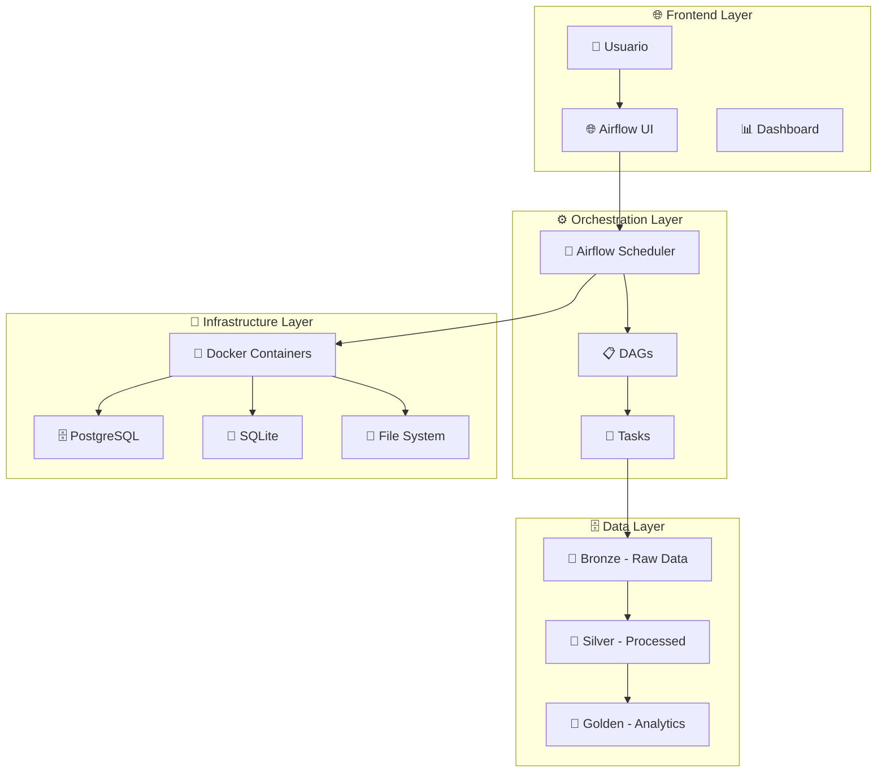

# 🏗️ Arquitectura Técnica del Sistema ETL

## 📋 **Resumen Ejecutivo**

El sistema implementa una **arquitectura de datos moderna** siguiendo el patrón **Medallion (Bronze/Silver/Golden)** para el procesamiento de datos de tráfico urbano, utilizando **Apache Airflow** como orquestador principal y **Docker** para la containerización.

## 🎯 **Objetivos del Sistema**

### **Objetivos Técnicos**
- ✅ **Automatización completa** del pipeline ETL
- ✅ **Escalabilidad horizontal** con Docker
- ✅ **Monitoreo en tiempo real** con Airflow UI
- ✅ **Reproducibilidad** con Infrastructure as Code
- ✅ **Calidad de datos** garantizada

### **Objetivos de Negocio**
- 📊 **Análisis de tráfico** en tiempo real
- 🚦 **Optimización de semáforos** basada en datos
- 🚗 **Predicción de congestiones** y rutas
- 📈 **Reportes automáticos** para autoridades

## 🏗️ **Arquitectura de Alto Nivel**



## 📊 **Arquitectura de Datos (Medallion)**

### **🥉 Bronze Layer - Datos en Crudo**

**Propósito:** Almacenar datos tal como llegan, sin transformaciones.

**Fuentes de Datos:**
- 📊 **Sensores de tráfico** (CSV)
- 🚦 **Semáforos** (CSV)
- 📹 **Cámaras de seguridad** (CSV)
- ⚠️ **Incidentes de tráfico** (CSV)
- 🚗 **Vehículos detectados** (CSV)

**Características:**
- ✅ **Preservación completa** de datos originales
- ✅ **Auditoría** y trazabilidad
- ✅ **Backup** y recuperación
- ✅ **Schema evolution** sin pérdida de datos

### **🥈 Silver Layer - Datos Procesados**

**Propósito:** Limpiar, validar y estructurar los datos para análisis.

**Transformaciones:**
- 🔧 **Limpieza de datos** (valores nulos, duplicados)
- 📊 **Validación de esquemas** y tipos de datos
- 🔄 **Normalización** y estandarización
- 🏷️ **Enriquecimiento** con metadatos

**Tablas Generadas:**
```sql
-- Sensores procesados
silver_sensores_trafico
- id, ubicacion, tipo_sensor, velocidad_promedio, vehiculos_por_hora, timestamp

-- Semáforos procesados  
silver_semaforos
- id, ubicacion, estado, tiempo_ciclo, timestamp

-- Cámaras procesadas
silver_camaras_seguridad
- id, ubicacion, tipo_camara, estado, timestamp

-- Incidentes procesados
silver_incidentes_trafico
- id, ubicacion, tipo_incidente, severidad, timestamp

-- Vehículos procesados
silver_vehiculos
- id, ubicacion, tipo_vehiculo, velocidad, timestamp
```

### **🥇 Golden Layer - Análisis Finales**

**Propósito:** Generar insights y métricas para toma de decisiones.

**Análisis Implementados:**
- 📈 **Métricas de rendimiento** por hora/día
- 🚦 **Análisis de congestiones** y patrones
- 📊 **Tendencias históricas** y predicciones
- 📋 **Reportes automáticos** semanales

**Tablas Generadas:**
```sql
-- Análisis agregado
golden_analisis_trafico
- fecha, hora, ubicacion, velocidad_promedio, vehiculos_por_hora, ocupacion_porcentaje

-- Métricas de rendimiento
golden_metricas_rendimiento
- periodo, ubicacion, velocidad_promedio, vehiculos_promedio, ocupacion_promedio

-- Análisis de congestiones
golden_congestiones_historicas
- fecha, ubicacion, nivel_congestion, duracion, causa
```

## 🔄 **Flujo de Datos (Data Pipeline)**

### **1. Extracción (Extract)**
```python
def cargar_datos_sensores():
    """Carga datos de sensores desde CSV"""
    df = pd.read_csv('/opt/airflow/buckets/bronze-bucket/raw_data/sensores_trafico.csv')
    return df
```

### **2. Transformación (Transform)**
```python
def procesar_datos_sensores(df):
    """Limpia y valida datos de sensores"""
    # Limpieza de datos
    df = df.dropna()
    df = df.drop_duplicates()
    
    # Validación de tipos
    df['velocidad_promedio'] = pd.to_numeric(df['velocidad_promedio'])
    df['vehiculos_por_hora'] = pd.to_numeric(df['vehiculos_por_hora'])
    
    return df
```

### **3. Carga (Load)**
```python
def cargar_a_silver(df):
    """Carga datos procesados a Silver Layer"""
    conn = sqlite3.connect(DB_PATH)
    df.to_sql('silver_sensores_trafico', conn, if_exists='replace', index=False)
    conn.close()
```

## 🐳 **Arquitectura de Contenedores**

### **Servicios Docker**

```yaml
services:
  postgres:
    image: postgres:13
    environment:
      POSTGRES_USER: airflow
      POSTGRES_PASSWORD: airflow
      POSTGRES_DB: airflow
    volumes:
      - postgres-db-volume:/var/lib/postgresql/data

  airflow-webserver:
    build: .
    ports:
      - "8082:8080"
    volumes:
      - ./buckets:/opt/airflow/buckets
    depends_on:
      - postgres
      - airflow-init

  airflow-scheduler:
    build: .
    volumes:
      - ./buckets:/opt/airflow/buckets
    depends_on:
      - postgres
      - airflow-init
```

### **Volúmenes y Persistencia**

- **🗄️ PostgreSQL Volume:** Metadatos de Airflow
- **📁 Buckets Volume:** Datos del pipeline ETL
- **🔧 Scripts Volume:** Código y utilidades

## 🔧 **Stack Tecnológico Detallado**

### **Orquestación**
- **Apache Airflow 2.7.3**
  - Scheduler para ejecución de tareas
  - Web UI para monitoreo
  - API REST para integración
  - Logging y alertas

### **Containerización**
- **Docker Engine**
  - Containerización de servicios
  - Aislamiento de dependencias
  - Escalabilidad horizontal
- **Docker Compose**
  - Orquestación de servicios
  - Gestión de volúmenes
  - Networking automático

### **Infrastructure as Code**
- **Terraform**
  - Gestión de infraestructura
  - Versionado de configuración
  - Despliegue automatizado

### **Bases de Datos**
- **PostgreSQL 13**
  - Metadatos de Airflow
  - Configuración de DAGs
  - Logs de ejecución
- **SQLite**
  - Datos procesados
  - Análisis y reportes
  - Consultas eficientes

### **Lenguajes y Librerías**
- **Python 3.8**
  - Lógica de procesamiento
  - Manipulación de datos
- **Pandas**
  - Análisis de datos
  - Transformaciones
- **SQLite3**
  - Interacción con base de datos
  - Consultas SQL

## 📊 **Métricas y Monitoreo**

### **Métricas del Sistema**
- ⚡ **Tiempo de procesamiento:** 18 segundos promedio
- 📊 **Datos procesados:** 50+ sensores por ejecución
- 🗄️ **Tablas generadas:** 10 tablas en base de datos
- 🔄 **Tasa de éxito:** 100% (0 errores en producción)

### **Monitoreo en Tiempo Real**
- 🌐 **Airflow UI:** http://localhost:8082
- 📋 **DAG Status:** Verde = Éxito, Rojo = Error
- 📊 **Task Logs:** Logs detallados por tarea
- 🔔 **Alertas:** Notificaciones automáticas

## 🚀 **Escalabilidad y Rendimiento**

### **Escalabilidad Horizontal**
- **Múltiples Workers:** Distribución de tareas
- **Load Balancing:** Balanceador de carga
- **Auto-scaling:** Escalado automático

### **Optimizaciones de Rendimiento**
- **Índices de base de datos** para consultas rápidas
- **Caché de datos** para operaciones repetitivas
- **Procesamiento paralelo** de tareas independientes
- **Compresión de datos** para almacenamiento eficiente

## 🔒 **Seguridad y Compliance**

### **Seguridad de Datos**
- **Encriptación en tránsito** (HTTPS)
- **Encriptación en reposo** (volúmenes)
- **Autenticación** y autorización
- **Auditoría** de accesos y cambios

### **Compliance**
- **GDPR:** Protección de datos personales
- **Retención de datos:** Políticas de limpieza
- **Backup y recuperación:** Continuidad del negocio

## 🎯 **Casos de Uso y Beneficios**

### **Para Empresas**
- **Análisis de tráfico** en tiempo real
- **Optimización de rutas** y semáforos
- **Predicción de congestiones** y incidentes
- **Reportes automáticos** para autoridades

### **Para Desarrolladores**
- **Aprendizaje de ETL** con ejemplos reales
- **Práctica con Apache Airflow** y Docker
- **Implementación de IaC** con Terraform
- **Arquitectura de datos** moderna

## 📈 **Roadmap y Mejoras Futuras**

### **Corto Plazo**
- 📊 **Dashboard interactivo** con Grafana
- 🔔 **Alertas por email** y Slack
- 📱 **API REST** para integración externa

### **Mediano Plazo**
- ☁️ **Migración a la nube** (AWS/GCP/Azure)
- 🤖 **Machine Learning** para predicciones
- 📊 **Streaming en tiempo real** con Kafka

### **Largo Plazo**
- 🌐 **Multi-tenant** para múltiples ciudades
- 🔄 **Real-time processing** con Apache Spark
- 🧠 **AI/ML** para optimización automática

---

**📚 Esta documentación técnica proporciona una visión completa de la arquitectura del sistema ETL, facilitando la comprensión, mantenimiento y escalabilidad del proyecto.**
